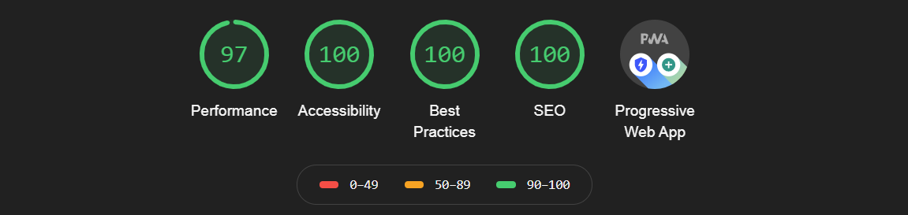

+++
# Project title.
title = "Minecraft Commands Cheat Sheet"

# Date this page was created.
date = 2020-08-02T00:00:00

# Project summary to display on homepage.
summary = "Minecraft admin commands reference cheat sheet for all editions, with detailed help documentation."

# Tags: can be used for filtering projects.
# Example: `tags = ["machine-learning", "deep-learning"]`
tags = ["Web", "React"]

# Optional external URL for project (replaces project detail page).
external_link = ""

# Slides (optional).
#   Associate this project with Markdown slides.
#   Simply enter your slide deck's filename without extension.
#   E.g. `slides = "example-slides"` references 
#   `content/slides/example-slides.md`.
#   Otherwise, set `slides = ""`.
slides = ""

# Links (optional).
#url_code = "https://minecraft-commands-cheat-sheet.tgratzer.com/"

# Custom links (optional).
#   Uncomment line below to enable. For multiple links, use the form `[{...}, {...}, {...}]`.
links = [{icon_pack = "fas", icon="globe-americas", name="Check it out", url = "https://minecraft-commands-cheat-sheet.tgratzer.com/"}]

# Featured image
# To use, add an image named `featured.jpg/png` to your project's folder. 
[image]
  # Caption (optional)
  caption = ""
  
  # Focal point (optional)
  # Options: Smart, Center, TopLeft, Top, TopRight, Left, Right, BottomLeft, Bottom, BottomRight
  focal_point = "Smart"
+++

## Overview

If you've ever messed around with Minecraft command blocks, you know Minecraft commands are powerful but obtuse. This site shows how the commands are written, with a quick reference format for browsing. You also get examples and deeper syntax explanations for each command available in the original Java Edition, and the Bedrock/Education Editions.

My first real foray into building a full-blown site with React, this page uses [Gatsby](https://www.gatsbyjs.org/) to create a pre-rendered (SSR) progressive web app (PWA), with [railroad diagrams](https://en.wikipedia.org/wiki/Syntax_diagram) of the commands syntax.

## Learning experiences

Gatsby is a pleasure to work with. The way you can load and query data sources into a pre-rendered application, along with the ecosystem of plugins available means you can spin up a mean application really quickly.

Also, by just keeping an eye out for accessibility, a very high Lighthouse score was well within reach.

Performance is great, since the page (before interactions) is already rendered, and I made sure the single font used was requested early in the network sequence. The tree shaking Gatsby performs wasn't 100% what Chrome thinks is possible, but a few kilobytes of waste are acceptable for such an app that uses a solid caching strategy.

As the page has few inputs, accessibility came down to ensuring the headers were structured correctly, contrast ratios met WCAG standards, and the inputs I did have provided adequate context.
