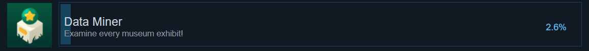
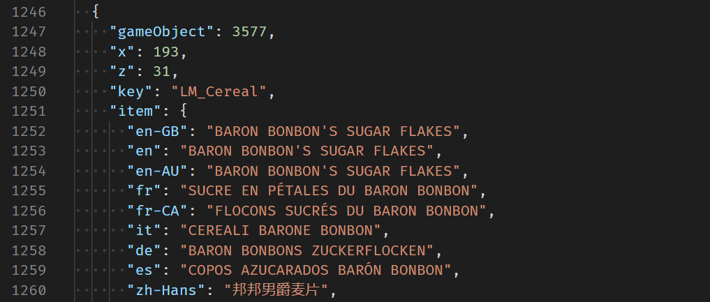

+++
# Project title.
title = "A Monster's Expedition Map"

# Date this page was created.
date = 2020-09-27T00:00:00

# Project summary to display on homepage.
summary = "Map and save viewer for an expansive puzzle game."

# Tags: can be used for filtering projects.
# Example: `tags = ["machine-learning", "deep-learning"]`
tags = ["Web", "React"]

# Optional external URL for project (replaces project detail page).
external_link = ""

# Slides (optional).
#   Associate this project with Markdown slides.
#   Simply enter your slide deck's filename without extension.
#   E.g. `slides = "example-slides"` references 
#   `content/slides/example-slides.md`.
#   Otherwise, set `slides = ""`.
slides = ""

# Links (optional).
#url_code = "https://minecraft-commands-cheat-sheet.tgratzer.com/"

# Custom links (optional).
#   Uncomment line below to enable. For multiple links, use the form `[{...}, {...}, {...}]`.
links = [{icon_pack = "fas", icon="globe-americas", name="Check it out", url = "https://monsterexpedition.tgratzer.com/"}]

# Featured image
# To use, add an image named `featured.jpg/png` to your project's folder. 
[image]
  # Caption (optional)
  caption = ""
  
  # Focal point (optional)
  # Options: Smart, Center, TopLeft, Top, TopRight, Left, Right, BottomLeft, Bottom, BottomRight
  focal_point = "Smart"
+++

## Overview

*[A Monster's Expedition](https://store.steampowered.com/app/1052990/A_Monsters_Expedition/)* is a clever and adorable puzzle game where you push logs around to travel to different islands. The world map has a lot of 'exhibits' to find, as well some very difficulty 'snowmen'.

After beating the game (and finding only one snowman) I wanted to see how far along I was. Maybe the game is just under-appreciated, but nobody had a full map of the game that was both complete and pleasant to look at, and there was absolutely no way to know where you'd actually been.

I created [the site](https://monsterexpedition.tgratzer.com/) partially to create a [Steam guide](https://steamcommunity.com/sharedfiles/filedetails/?id=2240268284) and partially just to look inside of my save file. Hopefully the community finds it useful.

## Data-Mining

The game jokingly calls you a data miner if you found every exhibit... Maybe this is what sparked the idea to actually do it.

I used a neat tool called the [Unity Assets Bundle Extractor](https://github.com/DerPopo/UABE) to read the exhibit keys (`LM_Cereal`), and applied a fair amount of post-processing with Python to correlate to where the game-objects pop up in the world (`x: 193, z: 31`).

Determining how the save file recorded your progress required perusing the decompiled C# code with [dotPeek](https://www.jetbrains.com/decompiler/).

## Mapping

The map uses [React Leaflet](https://react-leaflet.js.org/en/) with a custom projection to match up in-game coordinates to the map itself. The markers and other objects of interest are stored as data accessible at build time through GraphQL, which allows me the opportunity to eventually generate a dedicated page per island. Wouldn't that be a kickass walkthrough?
